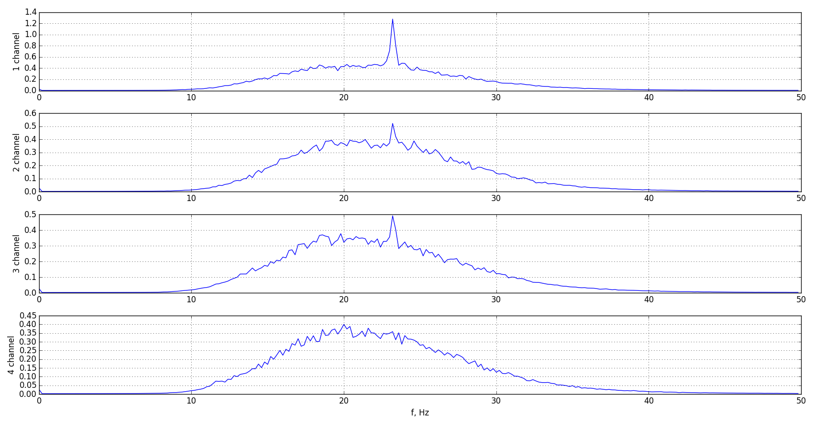

# Spectrum mean of EEG data

## Description

We continue to analysis real [EEG data](https://github.com/rcv911/periodogram/tree/master/data%20files) from one subject.

## Motivation

Analysis of biosignals is one of the most important thing now. Doctors doesn't have skills in programming languages, 
but they know a lot about medical things. Programmers can solve this problem, creating tools for doctors and helping them with detecting or 
estimating quickly. 

## Results

Here's EEG spectrum mean of 84 records each channels. Now it's good data for analysis. 

Spectrum has fluctuations of 13-40 Hz, so you can see [betta waves.](https://en.wikipedia.org/wiki/Beta_wave)

## Learn more

- [Wiki](https://en.wikipedia.org/wiki/Electroencephalography)
- You can use [scipy.signal.periodogram](https://docs.scipy.org/doc/scipy-0.13.0/reference/generated/scipy.signal.periodogram.html#scipy-signal-periodogram)

## Installation

You can use [Python](https://www.python.org/) with data package: [Anaconda](https://www.anaconda.com/) or [Miniconda](https://conda.io/miniconda).
There's another way - use [Portable Python](http://portablepython.com/). Also you can use whatever IDE for Python.

## License

Free